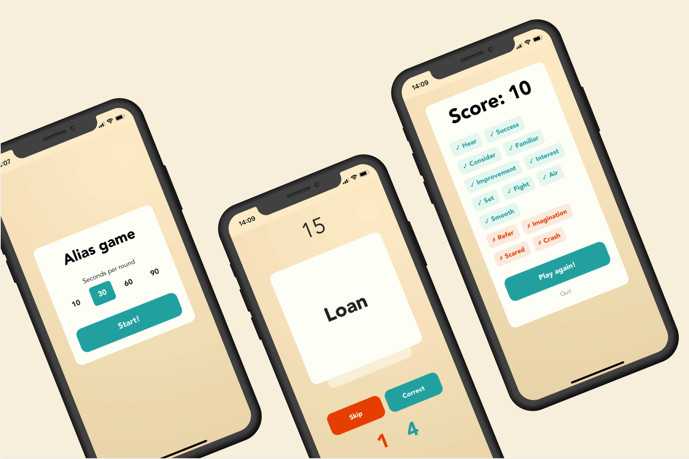

# Alias Game

A web-based implementation of the popular word-guessing game "Alias", optimized for both mobile and desktop. Add it to your home screen for a native-like app experience.

**Play the game: https://kubk.github.io/alias**

## How to Play

Alias is a team game that helps develop language skills. The goal is for you to explain a word to your teammates using hints and associations, without saying the actual word. For each word your team guesses correctly, you score a point.

## Features

- **2000 most common English words**: A curated list of popular words
- **Mobile-first design**: Fully responsive and works great on any screen size
- **PWA support**: Can be "installed" on a mobile device and used like a native app
- **Smooth animations**: Interactive elements are animated using Framer Motion for a fluid user experience

## Technologies Used

- **Framework**: [React](https://reactjs.org/)
- **State Management**: [MobX](https://mobx.js.org/)
- **Build Tool**: [Vite](https://vitejs.dev/)
- **Styling**: [Tailwind CSS](https://tailwindcss.com/)
- **Animations**: [Framer Motion](https://www.framer.com/motion/)
- **Language**: [TypeScript](https://www.typescriptlang.org/)