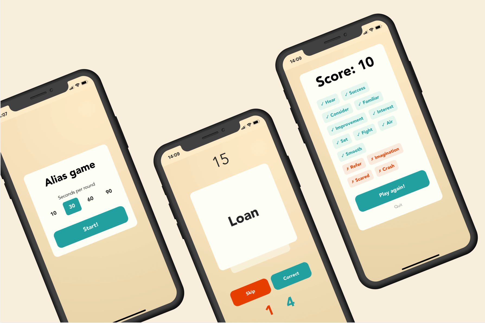

<h1 align="center">Alias Game</h1>

  Readme: <a href="../README.md">English</a>, <a href="./README.ru.md">Русский</a>

Веб-версия популярной игры «Алиас», оптимизированная для мобильных и десктопов. Добавьте на домашний экран для нативного опыта.

**Играть: https://kubk.github.io/alias**

## Как играть

Алиас — командная игра для развития языковых навыков. Цель — объяснить слово своей команде с помощью подсказок и ассоциаций, не называя само слово. За каждое угаданное слово команда получает очко.

## Возможности

- **Мультиязычность**: Играйте на английском или русском, каждый язык со своим набором слов
- **Мобильный дизайн**: Полностью адаптивный интерфейс для любого размера экрана
- **PWA**: Можно «установить» на мобильное устройство и использовать как нативное приложение
- **Плавные анимации**: Интерактивные элементы анимированы с помощью Framer Motion

## Технологии

- **Фреймворк**: [React](https://reactjs.org/)
- **Управление состоянием**: [MobX](https://mobx.js.org/)
- **Сборка**: [Vite](https://vitejs.dev/)
- **Стили**: [Tailwind CSS](https://tailwindcss.com/)
- **Анимации**: [Framer Motion](https://www.framer.com/motion/)
- **Язык**: [TypeScript](https://www.typescriptlang.org/)
